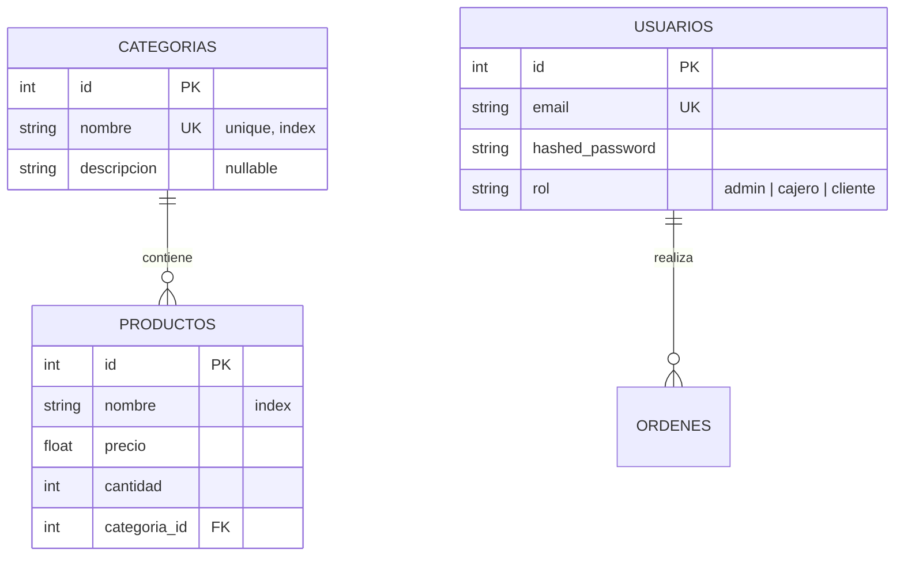
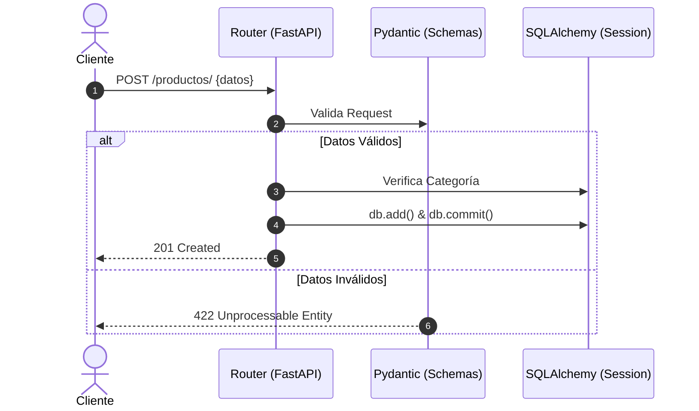
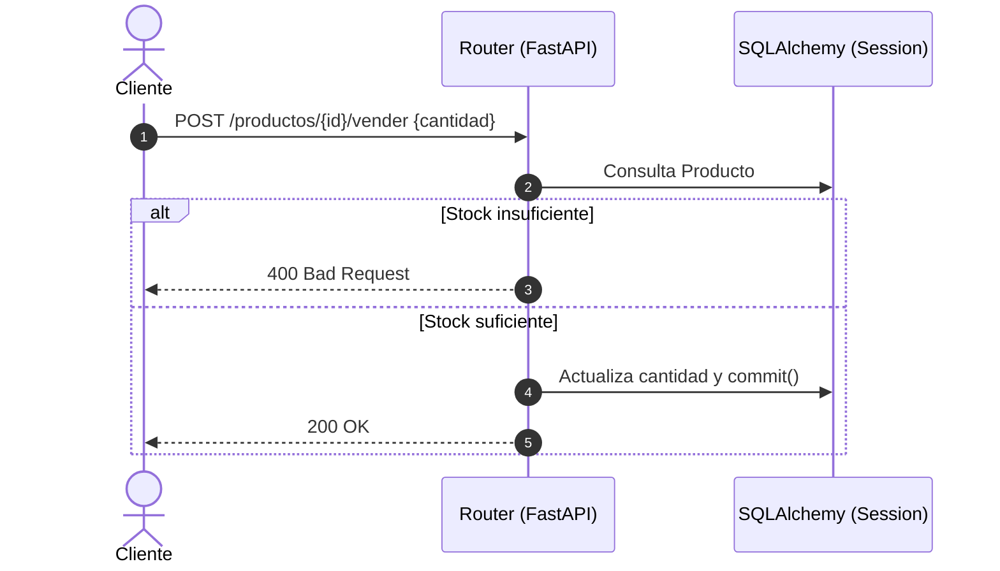
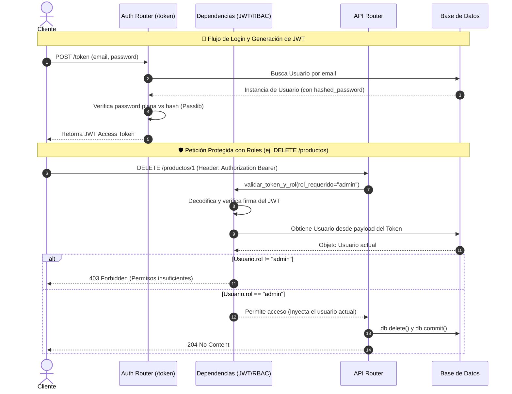

# 🛒 Supermercado API - Documentación Visual

## 📊 1. Modelo de Datos (ERD)

Representación de las tablas y sus relaciones en el sistema de inventario.

---

## 🔄 2. Flujos de Secuencia de Inventario

Procesos básicos de validación y reglas de negocio.

### A. Registro de Productos y Categorías

### B. Venta de Productos (Gestión de Stock)

---

## 🔐 3. Seguridad Avanzada (Auth & RBAC)

Flujo de acceso basado en tokens JWT y permisos por rol.

