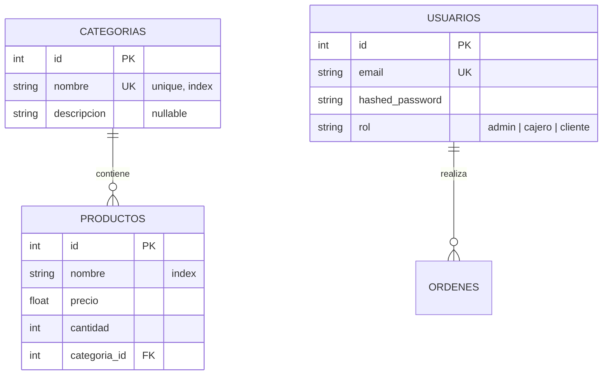
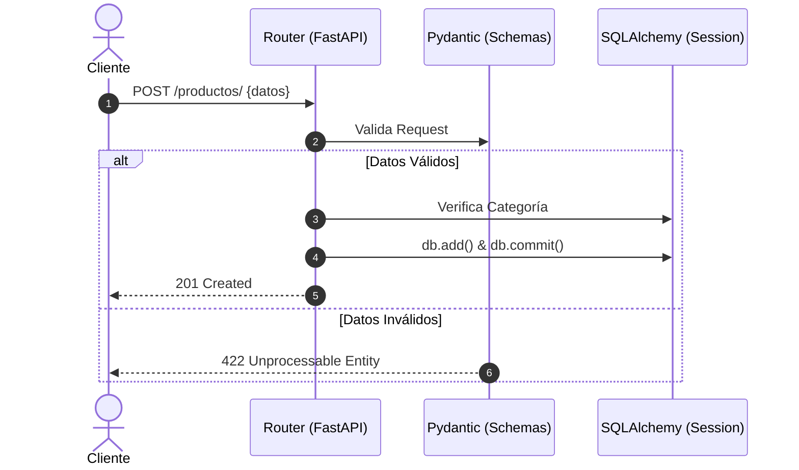
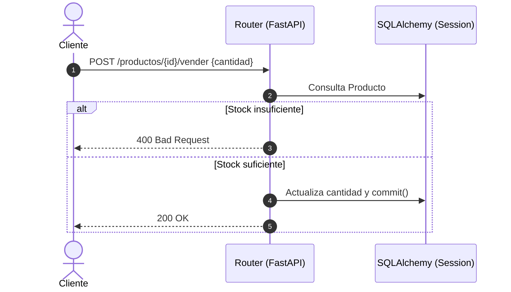
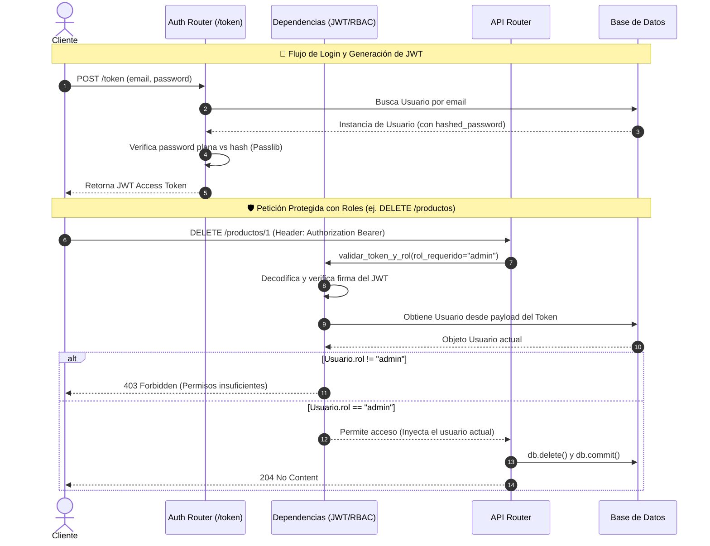

# 🛒 Supermercado API - Documentación Visual

## 📊 1. Modelo de Datos (ERD)

Representación de las tablas y sus relaciones en el sistema de inventario.



---

## 🔄 2. Flujos de Secuencia de Inventario

Procesos básicos de validación y reglas de negocio.

### A. Registro de Productos y Categorías



### B. Venta de Productos (Gestión de Stock)



---

## 🔐 3. Seguridad Avanzada (Auth & RBAC)

Flujo de acceso basado en tokens JWT y permisos por rol.




# 🛒 Supermercado API

Una API elegante y robusta para gestionar el inventario de un supermercado. Construida con **FastAPI**, **SQLAlchemy**, y **Pydantic v2**, siguiendo los principios de Clean Architecture y la metodología "Antigravity".

## 🚀 Tecnologías

- **Backend:** Python 3.10+, FastAPI
- **Base de Datos:** SQLite (SQLAlchemy ORM)
- **Validación:** Pydantic v2
- **Testing:** Pytest, TestClient

## 🛠️ Instalación y Configuración

Sigue estos pasos para levantar el entorno de desarrollo en tu máquina local.

### 1. Clonar el repositorio
Navega a tu directorio de preferencia y asegúrate de tener los archivos del proyecto.

### 2. Crear y activar un entorno virtual
Es una buena práctica aislar las dependencias del proyecto.

```bash
# Crear entorno virtual
python3 -m venv .venv

# Activar en Linux/macOS
source .venv/bin/activate

# Activar en Windows (PowerShell)
# .venv\Scripts\Activate.ps1
```

### 3. Instalar dependencias
Asegúrate de tener instalados los paquetes necesarios:

```bash
pip install fastapi "uvicorn[standard]" sqlalchemy pydantic pytest pytest-cov httpx

```

## 🏃‍♂️ Ejecución de la API

Para iniciar el servidor de desarrollo con recarga automática, ejecuta el siguiente comando desde la raíz del proyecto:

```bash
uvicorn app.main:app --reload
```

La API estará disponible en: `http://127.0.0.1:8000`

### Documentación Interactiva (Swagger UI)
FastAPI genera documentación interactiva automáticamente. Una vez que el servidor esté corriendo, visita:
- **Swagger UI:** http://127.0.0.1:8000/docs
- **ReDoc:** http://127.0.0.1:8000/redoc

### 4. Configurar Variables de Entorno +El proyecto utiliza variables de entorno para aislar la configuración y proteger los secretos. Copia el archivo de plantilla .env.example y renómbralo a .env: + +bash +cp .env.example .env + + +Abre el archivo .env recién creado y asigna tus propios valores, prestando especial atención a SECRET_API_KEY para poder acceder a los endpoints protegidos. 

## 📦 Endpoints Principales

### Categorías (`/categorias`)
- `GET /categorias/` - Lista todas las categorías.
- `POST /categorias/` - Crea una nueva categoría.
- `GET /categorias/{id}` - Obtiene los detalles de una categoría por su ID.
- `PUT /categorias/{id}` - Actualiza una categoría existente.
- `DELETE /categorias/{id}` - Elimina una categoría.

### Productos (`/productos`)
- `GET /productos/ - Lista todos los productos. Soporta filtros opcionales por query: ?nombre=X&precio_min=10&precio_max=50
- `POST /productos/` - Crea un nuevo producto validando la `categoria_id`.
- `GET /productos/{id}` - Obtiene los detalles de un producto.
- `PUT /productos/{id}` - Actualiza un producto existente.
- `DELETE /productos/{id}` - Elimina un producto.

## 🧪 Testing y Cobertura

El proyecto incluye una suite de pruebas automatizadas configurada para ejecutarse en una base de datos SQLite en memoria, asegurando que las pruebas sean rápidas y no afecten la base de datos de desarrollo.

### Ejecutar pruebas

```bash
pytest tests/ -v
```

### Generar reporte de cobertura (Coverage)

Para ver qué porcentaje de tu código está cubierto por las pruebas (en la terminal):

```bash
pytest --cov=. --cov-report=term-missing
```

Para generar un reporte HTML interactivo:

```bash
pytest --cov=. --cov-report=html
```